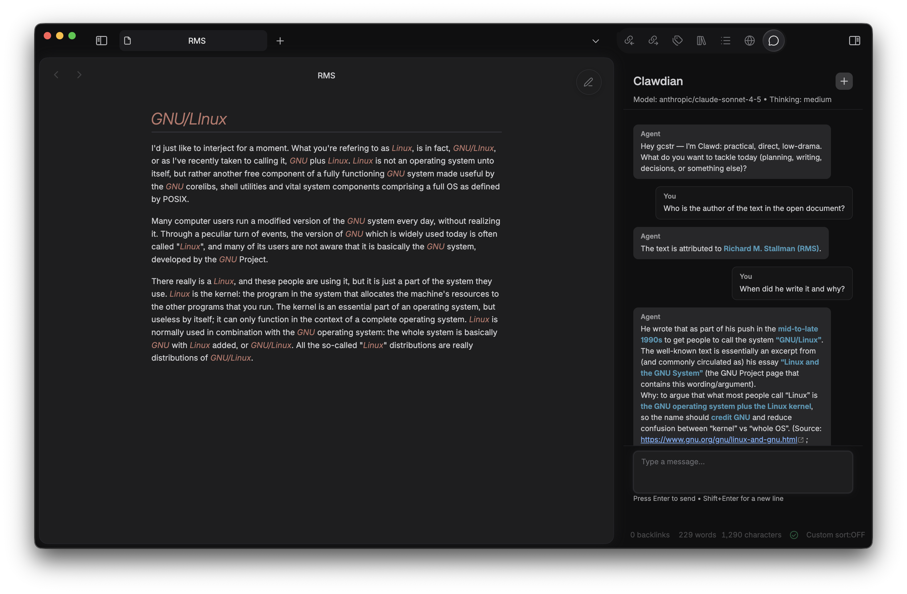

# Clawdian



Clawdian brings agent-powered query and editing to Obsidian by connecting your vault to an [OpenClaw](https://openclaw.ai/) Gateway, helping you explore, refine, and manage large note collections without leaving the editor.

It provides:
- A chat pane that talks to the agent through the Gateway (same behavior as the Control UI / Telegram).
- An Obsidian “node” endpoint that exposes `obsidian.*` commands to the Gateway, so the agent can read/search/edit your vault through a controlled API.
- A status pane and an activity log to make connection state and debugging visible.

## What it’s for

If you run OpenClaw and you keep your personal/work system in Obsidian, Clawdian lets you:
- Chat with your agent from inside Obsidian.
- Let the agent act on the vault via explicit commands (read/search/patch/create), instead of scraping files or using shell commands.
- Debug what’s going on when something breaks (auth, scopes, session routing, request/response frames).

## Features

### Chat view
- “New chat” button to reset the remote transcript (`/new`).
- Streaming responses.
- User messages render as Markdown (so formatting is preserved after sending).
- Copy/insert buttons on assistant code blocks.

### Node commands (Obsidian → Gateway)
Clawdian registers a node with a command catalog that typically includes:
- `obsidian.activeFile.get`
- `obsidian.selection.get`
- `obsidian.note.read`
- `obsidian.vault.list`
- `obsidian.vault.search`
- `obsidian.metadata.get`
- `obsidian.metadata.backlinks`
- `obsidian.tasks.search`
- `obsidian.note.replaceSelection`
- `obsidian.note.insertAtCursor`
- `obsidian.note.applyPatch`
- `obsidian.note.create`

The agent executes these through OpenClaw’s node invocation flow.

### Status + Activity Log
- Status pane shows node/chat connection state and last errors.
- Activity Log captures structured entries and can show raw Gateway frames when debug is enabled.

## Install

### Install via BRAT (recommended)

1. Install the **BRAT** plugin in Obsidian.
2. Open BRAT settings → **Add Beta plugin**.
3. Add this repository:
   - `gcstr/clawdian`
4. BRAT will download the latest GitHub Release assets (`manifest.json`, `main.js`, `styles.css`, `versions.json`) into your vault.

### Manual install (local build)

1. Build the plugin.
2. Copy the built files into your vault:
   `YOUR_VAULT/.obsidian/plugins/clawdian/`
3. Enable “Clawdian” in Obsidian → Settings → Community plugins.

## Configure

Open Obsidian → Settings → Clawdian.

You’ll typically set:
- **Gateway URL**: the Gateway WebSocket URL
- **Auth mode**: token or password
- **Gateway token/password**
- **Auto-connect**

The plugin also stores a device keypair for pairing.

## Usage

### Open the panes
Use the command palette:
- **Clawdian: Show status**
- **Clawdian: Show activity log**
- **Clawdian: Open chat**

### Chat
Type a message and press Enter to send. Use Shift+Enter for a new line.

The plugin intentionally sends the message “clean” (no automatic prompt injection).

## Development

### Requirements
- Node.js
- npm

### Publishing releases (for BRAT)

BRAT installs this plugin from GitHub Releases. A release must include these assets:
- `manifest.json`
- `main.js`
- `styles.css`
- `versions.json`

This repo includes a GitHub Actions workflow that builds and attaches those assets.

Release process:
1. Bump the version in `manifest.json`, `package.json`, and `src/constants.ts` (PLUGIN_VERSION).
2. Update `versions.json` if `minAppVersion` changes.
3. Commit.
4. Tag and push:

```bash
git tag vX.Y.Z
git push origin vX.Y.Z
```

The workflow will build and create a GitHub Release for that tag.

### Install deps

```bash
npm install
```

### Run tests

```bash
npm test
```

### Build

The project uses an esbuild-based build config. Make sure dependencies are installed.

```bash
npm run build
```

If you see an error like “Cannot find package 'esbuild'”, run `npm install` in the repo.

## Troubleshooting

### Chat connects but responses don’t show up
This has historically been caused by session key mismatches between local session keys and gateway-prefixed keys. Check the Activity Log and confirm chat events are being received.

### “missing scope: operator.write”
Chat connections need operator scopes. Ensure the chat connection uses a gateway token with `operator.read`/`operator.write` and does not fall back to a node device token.

### Origin not allowed
If you see “origin not allowed … allowedOrigins”, it usually means you’re trying to connect using a client identity that the Gateway treats as a web origin. Clawdian avoids requiring Control UI allowed-origin configuration.

## License

TBD.
